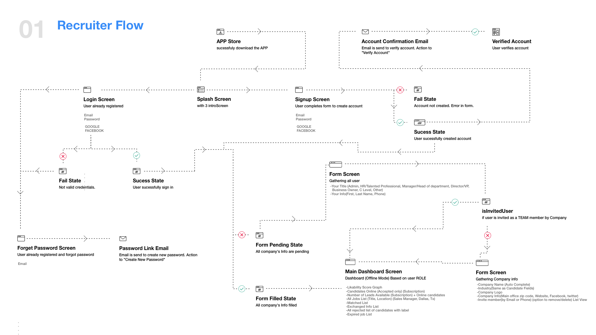

# fliphire-backend

Fliphire backend project

 

## Backend Info

**1. DB cluster access info**

| Stage | Cluster endpoint                                                   | Bastion             | master username | master password | DB Cluster Identifier | DB name  |
| ----- | ------------------------------------------------------------------ | ------------------- | --------------- | --------------- | --------------------- | -------- |
| dev   | fliphire-dev.cluster-c18dz1bb8ta9.us-east-1.rds.amazonaws.com:3306 | ubuntu@54.221.32.11 | root            | t#HBL915Mc      | fliphire-dev          | fliphire |

**2. GraphQL API (AppSync service)**

| Stage | API URL                                                                        | API ID                     | Auth Mode                 |
| ----- | ------------------------------------------------------------------------------ | -------------------------- | ------------------------- |
| dev   | https://kxc2fr2j4vbmloo764zdrevunm.appsync-api.us-east-1.amazonaws.com/graphql | vjcg6ps2ujctngxedmyzyfpblq | AMAZON COGNITO_USER_POOLS |
| alpha | https://p67j7csy2nd77amxkcec62izsu.appsync-api.us-west-2.amazonaws.com/graphql | bm5eamtcrzczlduyl4jjksqmpm | AMAZON COGNITO_USER_POOLS |
| beta  | https://r62gkryexzhanke745qwobgx6i.appsync-api.us-west-2.amazonaws.com/graphql | lcph5plnifhf7oarn5clycjgoa | AMAZON COGNITO_USER_POOLS |

 

**3. REST API (Handlers service)**

  - **Gateway Info**

| Stage | Service Endpoint                                             | API Key                                  |
| ----- | ------------------------------------------------------------ | ---------------------------------------- |
| dev   | https://9pc4iqvwh5.execute-api.us-east-1.amazonaws.com/dev   | qYJboELQik2Sf6i2olN6Q44GvJxQt2hD5R4tC3bS |
| alpha | https://onc3w46kr8.execute-api.us-west-2.amazonaws.com/alpha | REzBU0NNGW9mImSDOV7Zx2SeNdxDBCG35Ow3ij75 |
| beta  | https://oouoln8d5l.execute-api.us-west-2.amazonaws.com/beta  | wmuUIrE0Xm2aNA6tsSflR2q5ISjiKCeZ4mr2pZrm |

 

  - **Specification For Endpoints**
  
| Endpoint | Method | Path                 | Auth Mode         | Description                                  |
| -------- | ------ | -------------------- | ----------------- | -------------------------------------------- |
| send     | GET    | /email/send          | Private (API Key) | send a verification email to registered user |
| verify   | GET    | /email/verify        | Public (None)     | verify confirmation email and confirm user   |
| register | POST   | /invitation/register | Public (None)     | register an invitation                       |
| job      | GET    | /job                 | Public (None)     | fetch the job info from fliphire             |

 

**4. Cognito User Pool and IdentityPool**

| Stage | IdentityPoolId                                 | UserPoolId          | Recruiter ClientId         | Candidate ClientId         | Admin ClientId             |
| ----- | ---------------------------------------------- | ------------------- | -------------------------- | -------------------------- | -------------------------- |
| dev   | us-east-1:5f0e48e0-3898-493e-bb71-1647bc1c8ebf | us-east-1_aqcb7SbPr | 713lua0fadna862uglh9oivjdt | 36ndbu8l7aoudbdl0lkesmpga5 | 68ptj82ce02csl35rrtnd2so0u |
| alpha | us-west-2:4cd01ec3-12bc-417c-a58c-3e8b7b0abd88 | us-east-1_wR4seZ2kA | hkvt2r4gmek11jnmvrlt2eugg  | 5kvidfh2r8hluomct6uq5d4qj6 | 4n5btufcc296lg9555mq2hr0or |
| beta  | us-west-2:d40dff11-1dfa-48d8-8451-d8aad695cfd0 | us-east-1_BpYnO73TL | 40u7scvguiaegbik20dqufu50r | 5il1sscafflj20lqu38jifv2bl | 16aiv0scc8ubh86mn0gdoimv3n |

 

## Schema Diagram

 

## GraphQL Schema

You can refer this entire schema to understand the details when you call queries:

[GraphQL Schema](services/appsync/schema.gql)

 

## API calls

Here is some sample queries, mutations and subscriptions:

[Queries](aws/queries.txt)

 

## Architecture

 

## MatchStatus Meanings

| MatchStatus enum value | Description                                                                                                                                                                                                                                                                                          |
| ---------------------- | ---------------------------------------------------------------------------------------------------------------------------------------------------------------------------------------------------------------------------------------------------------------------------------------------------- |
| Pending                | when Candidate Applied to JOB                                                                                                                                                                                                                                                                        |
| More                   | if Recruiter not satisfied his application and want to ask more questions (Show More Question Card)                                                                                                                                                                                                  |
| Declined               | when Recruiter not liked candidate's application. (Show Not Matched Card)                                                                                                                                                                                                                            |
| Accepted               | when Recruiter liked his application. (Show Matched Card)                                                                                                                                                                                                                                            |
| Waiting                | When candidate accepted recruiter's offer, through Matched Card, for next round (interview). The main reason why we are giving this option to candidate again because in the meantime he might get some good offer from other company and at that time he is not interested with this recruiter/job. |
| Withdrawn              | When Candidate Refused recruiter's offer for next interview round. It means he don't want to continue with this recruiter for any reason. (same reason as above)                                                                                                                                     |
| IsReady                | When the recruiter asked candidate for interview                                                                                                                                                                                                                                                     |
| ReadyForInterview      | candidate accepted interview asking and is ready for interview (2nd slot in interview queue of recruiter)                                                                                                                                                                                            |
| Interview              | candidate is in 1st slot of interview queue and ready for starting interview                                                                                                                                                                                                                         |
| Interviewing           | both parties are in interview call                                                                                                                                                                                                                                                                   |
| Postponed              | Candidate rejected on interview notification and postponed for next time                                                                                                                                                                                                                             |
| Interrupted            | The interview has been interrupted during interview round                                                                                                                                                                                                                                            |
| InterviewFinished      | Both parties have completed interview                                                                                                                                                                                                                                                                |
| RecruiterExchanged     | The recruiter exchanged information with the candidate                                                                                                                                                                                                                                               |
| CandidateExchanged     | The candidate exchanged info with recruiter                                                                                                                                                                                                                                                          |
| Exchanged              | After interview round they both exchanged information(email & Phone).                                                                                                                                                                                                                                |
| NotExchanged           | Not exchanged any info with the recruiter.                                                                                                                                                                                                                                                           |

 

## Application State Chart

This state chart will show the transition flow between above all states.

Here, each application state comes from above table.

 

## Candidate Workflow 1

 

## Candidate Workflow 2

 

## Recruiter Workflow 1

 

## Recruiter Workflow 2

 
